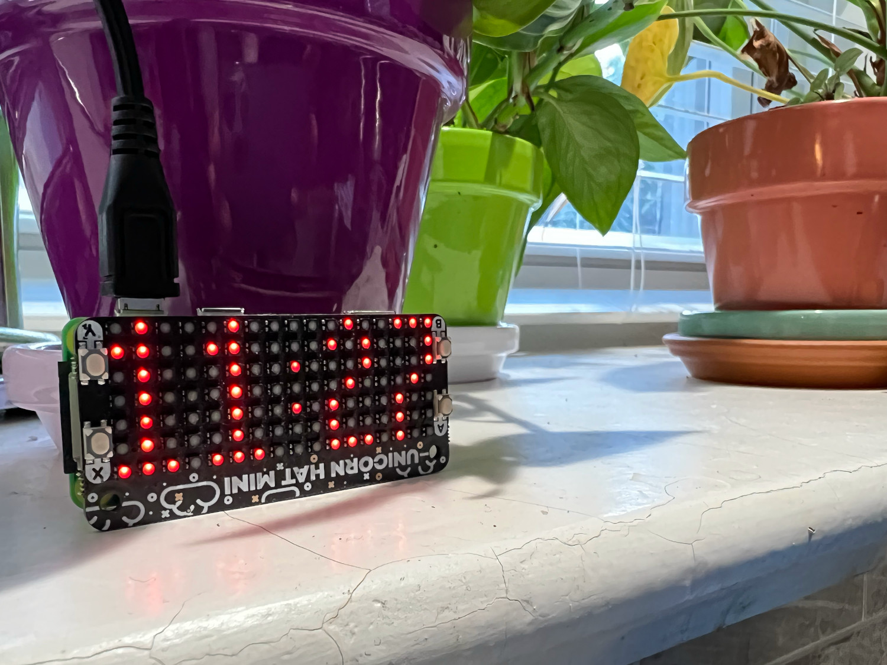

# Smart Clock
A smart clock which displays the current time and communicates with the [Smart Frame](https://github.com/GrandmaFunk/smart-frame) via a Google Cloud Firestore database. This clock sends new messages which the frame is listening for. In return, the frame can set a boolean ```blink``` value which the clock listens for. When the Smart Frame sends a blink, the middle portion of the clock bounces back and forth until a button is pressed to acknowledge the blink.

Made for the [Pimoroni Unicorn Hat Mini](https://shop.pimoroni.com/products/unicorn-hat-mini).



## Additional Setup
Setup will vary by device, but below are additional setup commands for Raspberry Pi compatibility that may be useful in case of errors:
```
# To solve the arm-linux-gnueabihf-gcc/ rpi-gpio error
sudo apt-get install python3-dev
# To get numpy/pandas working
sudo apt-get install libatlas-base-dev
```
A ```memos.csv``` file is needed with 2 columns: ```date``` and ```memo```. All days of the year should be in the date column, with the message that are to be displayed on each date in the memo column. For any dates which are missing messages, the previous message is used.

## Secrets Storage
An uncommitted ```.secrets``` directory holds the Google Authentication Credentials. 
